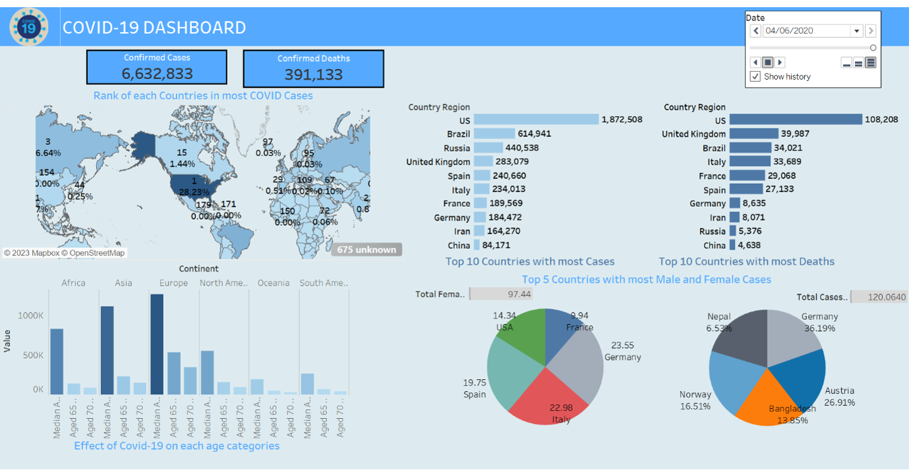

# COVID---19-Dashboard-using-Tableau
Interactive COVID-19 dashboard built using Tableau to analyse global cases, deaths, geographical distribution, and demographic trends through data visualisation.

## Overview

This project presents an interactive COVID-19 dashboard developed using Tableau to visualise and analyse global pandemic data. The dashboard provides insights into confirmed cases, deaths, geographical distribution, age-wise impact, and country-level statistics through interactive visualisations.

The project demonstrates the application of business intelligence and data visualisation techniques for analysing large-scale public health data.

---

## Features

- Interactive dashboard with date filter
- Global COVID-19 cases visualisation
- Worldwide geographical analysis using maps
- Country-wise confirmed cases
- Country-wise death analysis
- Age category analysis
- Interactive charts and KPIs
- Data-driven insights using Tableau

---

## Dashboard Components

- Total Confirmed Cases KPI
- Total Confirmed Deaths KPI
- Interactive World Map
- Top Countries by Confirmed Cases
- Top Countries by Deaths
- Age Category Analysis
- Country Comparison Charts
- Date Filter for Dynamic Analysis

---

## Technologies Used

- Tableau Desktop
- Data Visualisation
- Business Intelligence
- Interactive Dashboard Design

---

## Business Insights

The dashboard helps users:

- Monitor global COVID-19 confirmed cases
- Compare country-wise infection rates
- Analyse death statistics across countries
- Understand geographical spread of COVID-19
- Study age-based distribution trends
- Perform interactive time-based analysis

---

## Dashboard Preview

---

## Applications

- Healthcare Analytics
- Public Health Monitoring
- Business Intelligence
- Government Reporting
- Data Visualisation
- Pandemic Analysis

---

## Future Improvements

- Live API integration
- Vaccination statistics
- Recovery rate analysis
- Forecasting using Machine Learning
- Regional drill-down dashboards
- Hospital resource analysis

---

## Author

**Akhil Mathew Cherian**

MSc Data Science | Data Analytics | Tableau | SQL | Python | Power BI
